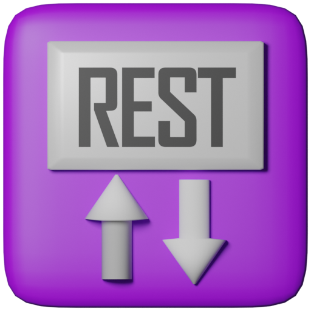

# REST API Server for Godot 4.x

This is a plugin adding a TCP server specialized in RESTful API, entirely written in GDScipt, and compatible to both HTTP and HTTPS.

The plugin adds two new nodes: `RESTHttpServer`, which is the main HTTP server, and `RESTApiHandler` nodes to be added as children to the first one. The `RESTApiHandler` node allows you to set (via `export var`) a list of endpoints to serve, and provides signals for when the `GET`, `PUT`, `POST` and `DELETE` requests are received.

If you want to separate different signal connections for different groups of endpoints, you can have multiple `RESTApiHandler` nodes as children of the `RESTHttpServer` (and is the reason they are separate nodes).

Endpoints can have parameters (starting with `:`), which are provided in the signals as dictionaries. 


Example: an endpoint is defined as `users/:username/slots/:slot_number`.

That means sending a `GET` request to:

```
users/alice/slots/3
```

Will emit a signal passing the endpoint as defined in the server, and a dictionary containing:

```python
{
    "username": "alice",
    "slot_number": "3"
}
```

For more detailed explanation, check the hints for the export vars and signals, on those two nodes.

For a full working demonstration, check the example at `res://addons/rest_api_server/example/example.tscn`.

----

The lower level code (handling the actual TCP connections) is heavily based on [deep-entertainment's GodotTPC](https://github.com/bit-garden/godottpd) - which is included as a subfolder in `res://addons/rest_api_server/godottpd` - and care was taken to not break compatibility. This is so if you do need GodotTPD's functionality as well, you won't need to add it again separately - you can just use the provided one. That said, the classes were all renamed (`HttpServer` -> `RESTHttpServer`), in case you want to modify this plugin to better adapt to your RESTful application, and have the option to add the original GodotTPD alongside, which will not collide with class names.